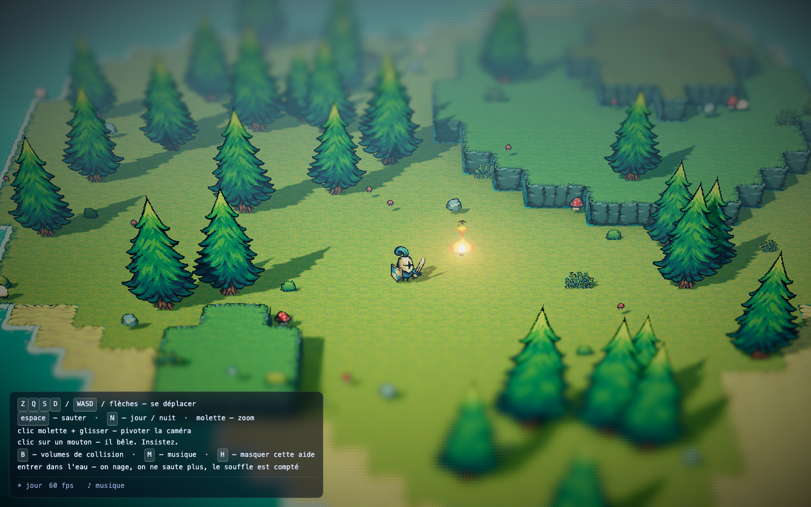
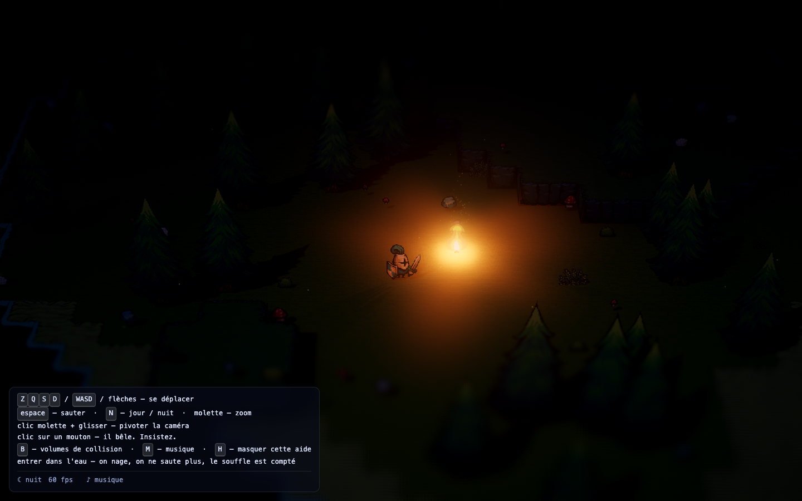
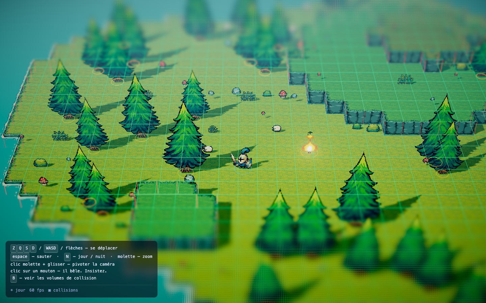

# Le rendu HD-2D — ce qui fait le style, et les pièges

Sprites pixel art plantés dans une vraie scène 3D éclairée — la recette d'Octopath
Traveler et de The Adventures of Elliot, appliquée aux assets **Tiny Swords**
(Pixel Frog). Three.js, pas de moteur.

> **Origine.** Ce document est le carnet de bord du PoC `poc-hd-2d`, écrit pendant que le rendu se
> cherchait, puis rapatrié ici quand le chantier S1 a porté ce PoC en `@lindocara/hd2d` et
> `apps/lab` (voir [le spec du reboot](./superpowers/specs/2026-08-02-hd2d-reboot-design.md)). Le
> dépôt d'origine n'existe plus ; les chemins ci-dessous ont été repointés vers le code porté.
>
> **C'est un registre de pièges autant qu'une explication.** Chaque section dit ce qui a été
> essayé et n'a pas marché, la mesure qui a tranché, et pourquoi un réglage vaut ce qu'il vaut.
> S3 (le renderer du jeu) et S5 (la scène de l'éditeur) le reliront autant que S1 l'a fait.
>
> **S3's first increment has landed** (2026-08-04): the game itself now draws through this engine and
> the PixiJS renderer is deleted. What that file knew, and what the port cost, is the section
> [The game's renderer](#the-games-renderer--what-retiring-pixijs-cost-and-taught) near the end.
> It is written in English — the repository's language rule applies to everything written from now
> on; the French sections above stay as they were written.




## Lancer

```bash
npm run lab
```

| Entrée | Effet |
| --- | --- |
| `ZQSD` / `WASD` / flèches | déplacer le héros |
| `espace` | sauter |
| `1` | attaquer — un coup d'épée, sans conséquence pour l'instant |
| `N` | jour ↔ nuit |
| molette | zoom |
| clic droit + glisser | pivoter la caméra (±20°, revient seule au relâchement) |
| `F` | parler — à Grota, le panda de la petite île du sud |
| `échap` | couper court à la conversation |
| clic sur un mouton | il bêle — et si vous insistez, il éclate |
| `B` | afficher les volumes de collision |
| `H` | masquer le bloc d'aide |
| `M` | couper le son |
| entrer dans l'eau | on nage : plus lent, pas de saut, souffle compté |

Le curseur est celui du pack (`UI/Pointers`), et il passe à la **main** au survol
d'un mouton — la seule chose cliquable de la scène. Le menu contextuel de Chrome
est supprimé sur le canvas, puisque le clic droit y sert à pivoter ; il reste
disponible partout ailleurs dans la page.

Le rendu est plafonné à 60 fps (`TARGET_FPS` dans `apps/lab/src/settings.ts`) : au-delà on
brûle du GPU pour rien, la vitesse de jeu ne bouge pas — tout est en delta-time.

## Le chargement

Tout est téléchargé et décodé avant que la scène ne se construise, et le
pourcentage est **pesé en octets** (`packages/hd2d/src/loader.ts`), pas en nombre de
fichiers : une nappe d'ambiance pèse 700 ko quand un bruit de pas en fait 30.
Compter les fichiers aurait fait filer la barre à 90 % en une fraction de seconde
puis l'aurait laissée coincée là tout le reste du temps — la barre de progression
qu'on ne veut pas. Les en-têtes HTTP reviennent bien avant les corps,
donc le total est connu dès le départ et le pourcentage ne recule jamais. Le
téléchargement pèse 85 %, le décodage — images vers textures, OGG vers tampons
audio — les 15 derniers.

Vient ensuite un bouton **JOUER**, et il n'est pas décoratif : un navigateur
n'autorise le son qu'après un geste, et il n'y en a aucun au chargement d'une
page. Sans lui, la scène démarrait muette jusqu'à ce qu'on touche une touche par
hasard — et le plus souvent on ne remarquait même pas ce qui manquait. Le
contexte audio, lui, naît suspendu : c'est justement ce qui permet de tout
décoder pendant le chargement et de n'avoir plus qu'à le réveiller au clic.

La boucle de rendu, elle, tourne **derrière** l'écran de chargement : le premier
plan est déjà cadré et les shaders déjà compilés, si bien que le voile se lève
sur une image vivante et non sur une frame noire.

## Ce qui fait le style

Le pixel art ne fait pas le HD-2D : ce sont les couches en dessous.

| Ingrédient | Où |
| --- | --- |
| **Décor en vraie 3D** — chaque tuile est un bloc, les falaises sont des parois | `packages/hd2d/src/terrain/mesh.ts` |
| **Autotiling** — les bordures organiques du pack, choisies par masque de voisinage | `packages/hd2d/src/terrain/mesh.ts` |
| **Un tileset par palier** — l'altitude se lit à la teinte de l'herbe | `packages/hd2d/src/terrain/mesh.ts` |
| **Sprites billboardés** — plans strictement verticaux, pivotés sur les pieds, étirés pour compenser la plongée | `packages/hd2d/src/billboard.ts` |
| **Caméra quasi-orthographique** — FOV 22°, 38° au-dessus de l'horizon | `CAMERA` dans `apps/lab/src/settings.ts` |
| **Éclairage temps réel** — soleil, hémisphérique, feu de camp qui vacille, tous avec ombres portées | `apps/lab/src/main.ts`, `apps/lab/src/world/props.ts` |
| **Ombres reçues par les sprites** — le héros s'assombrit sous un arbre, sous un nuage | `packages/hd2d/src/billboard.ts` |
| **Contre-jour** cantonné aux sprites par un calque : un liseré sur une seule de leurs arêtes | `apps/lab/src/main.ts`, `RIM_LAYER` |
| **Occlusion de contact** en vertex color — le pied des falaises, le creux des marches | `packages/hd2d/src/terrain/mesh.ts` |
| **Ombres de nuages** — une couverture qui dérive et multiplie l'albédo, décor **et** sprites | `packages/hd2d/src/clouds.ts` |
| **Mer à profondeur** — turquoise sur les hauts-fonds, bleu au large, quatre houles analytiques pour la normale | `packages/hd2d/src/terrain/mesh.ts` |
| **Écume animée** glissée sous les cases de terre du rivage | `packages/hd2d/src/terrain/mesh.ts` |
| **Rafales de vent** — la phase d'oscillation se déduit de la position, la bourrasque traverse l'île | `apps/lab/src/world/props.ts` |
| **Braises, lucioles, pollen** — des points additifs pour meubler le vide entre les sprites | `packages/hd2d/src/particles.ts` |
| **Fondu jour ↔ nuit** de toute l'ambiance, couleurs comprises, et azimut du soleil qui dérive | `packages/hd2d/src/mood.ts` |
| **Nuit noire** — loin du feu, il n'y a plus rien : c'est la source posée qui éclaire, pas le ciel | `MOODS.night` dans `apps/lab/src/settings.ts` |
| **Tilt-shift** — flou gaussien séparable piloté par la position verticale à l'écran. C'est *la* signature | `packages/hd2d/src/shaders.ts` |
| **Bloom + étalonnage + vignette + MSAA** | `packages/hd2d/src/pipeline.ts` |

La bande nette du tilt-shift suit le héros à l'écran : il reste net où qu'il aille.

Le brouillard suit le zoom — réglé en dur, il noierait l'île dès qu'on recule —
mais **pas des deux côtés à la même vitesse**. Le suivre à l'identique rendrait
le dézoom parfaitement neutre : la même image, en plus petit. Le plan proche
reste donc proportionnel, si bien que le héros garde exactement sa netteté à
tous les zooms, pendant que le plan lointain grandit moins vite
(`CAMERA.fogFar = 0.38`). La bande se resserre à mesure qu'on recule : l'île se
dissout par les bords et la maquette gagne son lointain. Le rayon du tilt-shift
suit la même intention (`zoomBoost`). À la distance de référence, les deux
n'ont aucun effet : la vue par défaut est inchangée.

Il y a bien une **voûte céleste** (`packages/hd2d/src/sky.ts`) — dégradé, halo de
l'astre, étoiles procédurales — mais autant le dire : à 38° de plongée et 22° de
champ, la caméra regarde de 27° à 49° *sous* l'horizon, à tous les zooms. Le ciel
n'entre jamais dans le cadre. Ce qu'on voit en haut de l'image, c'est la mer
lointaine noyée dans le brouillard — et c'est pour ça que le brouillard prend la
couleur d'horizon de cette voûte : la bande haute devient un vrai horizon
dégradé. Le reste ne se révèle qu'en redressant `CAMERA.pitch`.

### La nuit

Elle ne se contente pas de teinter la scène en bleu : **loin d'une source, il
n'y a plus rien**. On s'écarte du feu de quelques pas et le héros n'est plus
qu'une silhouette ; à l'autre bout de l'île, c'est du noir.

C'est le modèle de Minecraft, sans avoir à le simuler. La clarté d'un bloc y
vaut le maximum entre la lumière du ciel — au plus bas la nuit — et celle des
sources posées, qui décroît avec la distance. Ici la somme des deux fait la même
chose : un clair de lune ramené à 0.62, juste de quoi qu'une silhouette et une
ombre portée existent encore, et un foyer dont la décroissance en 1/d² creuse le
noir dès qu'on s'en écarte. Son intensité nominale est montée à 13 en
compensation : c'est tout ce qu'il y a *autour* qui descend, pas la flaque.

Trois réglages tiraient dans l'autre sens et il a fallu les corriger :

- le **lift** de l'étalonnage, à 0.015, relevait les noirs — soit exactement ce
  qu'on ne veut pas ici. À zéro ;
- le **contre-jour**, à 0.5, détourait chaque sprite d'un liseré bleu partout, y
  compris au fond du noir. À 0.12 ;
- le **brouillard**, dont la couleur d'horizon restait un bleu clair : le
  lointain gardait un halo qu'aucune lumière ne justifiait. L'horizon de nuit est
  descendu à `#080e1e`, et la portée s'est resserrée — au-delà, il n'y a de toute
  façon plus rien à voir.

Trop bas, ça ne marche pas non plus : à 0.34 de lune, l'île disparaissait
purement et simplement et il ne restait que la flaque du feu dans du vide.

Reste que rendre la nuit noire rend la lumière du foyer d'autant plus visible —
et elle se lisait alors comme **un gros rond**. Trois choses le corrigent :

- **une longue traîne.** Un `createRadialGradient` ne peut donner qu'un disque à
  pente constante, et cette pente régulière, l'oeil la lit comme un contour. La
  tache est donc fabriquée pixel par pixel, avec un alpha qui décroît en
  puissance 3 : il n'y a plus de rayon où elle « s'arrête » ;
- **un contour qui ondule.** Le rayon est modulé par trois harmoniques de
  l'angle. Ce n'est plus un cercle, c'est une flaque ;
- **deux couches.** Une seule tache, si douce soit-elle, garde un rayon dominant
  qu'on finit par retrouver. Une petite sous le foyer et une large très diluée
  par-dessus, de formes, de phases et de vitesses différentes, à poids égal :
  donner le dessus à la petite lui rend aussitôt son statut de tache principale,
  et le rond revient.

La source elle-même tremble de quelques centimètres au fil du vacillement : les
ombres qu'elle porte bougent, et le bord de la flaque cesse d'être une frontière
fixe.

## Grota

Le seul PNJ de la scène : un panda au chapeau de paille (Enemy Pack), planté sur
le mamelon de la **petite île du sud**. C'est-à-dire là où l'on ne va qu'à la
nage — un ermite qu'il faut aller chercher vaut mieux qu'un ermite sur le
chemin, et ça donne enfin une raison d'aller là-bas.

Il ne fait que deux choses : se balancer, et se tourner vers qui l'approche. Il
porte un collider, on ne lui marche pas dessus.

`F` ouvre le bandeau, `F` déroule, `échap` coupe court. Tant que la réplique
s'écrit, `F` la **termine** ; une fois écrite, elle passe à la suivante — la
convention de tous les jeux à dialogues, et elle évite d'avoir à choisir entre
lire à son rythme et ne pas attendre. S'éloigner referme : un bandeau orphelin à
l'écran pendant qu'on nage n'aurait aucun sens.

Pendant la conversation, le héros est **spectateur** : ni pas, ni saut, ni coup.
Les commandes sont neutralisées dans la boucle et non dans `hero.js` — c'est la
scène qui sait qu'une conversation est en cours, pas le personnage. Le zoom et la
rotation de caméra, eux, restent libres : ils ne sont pas de son ressort.

Le bandeau n'a pas de cadre : c'est un noir dont les deux bords se fondent dans
la scène. Un rectangle franc poserait une boîte par-dessus le jeu ; le dégradé le
fait affleurer. Il est centré horizontalement et **centré dans la moitié basse**
de l'écran — son axe tombe donc aux trois quarts de la hauteur. Le bloc d'aide,
qui occupe le même bas d'écran, s'efface le temps de la conversation ; c'est une
classe distincte de `hidden`, sinon parler annulerait le choix fait avec `H`.

### Sa voix

Grota est **doublé** : quatre prises, une par réplique (`assets/voices/`,
converties en Opus mono 56 kbit/s — 670 ko de MP3 tombent à 265). Elles ne
passent pas par `jouer()`, qui tire une variante et une hauteur au hasard : c'est
exactement ce qu'il ne faut pas faire à une voix.

Le point qui compte, c'est que **c'est la voix qui donne le tempo, pas
l'inverse**. `sayLine()` renvoie la durée de la prise, et le bandeau en déduit sa
cadence de frappe : `longueur / durée`. Une réplique de neuf secondes écrite à
42 caractères par seconde serait finie en une seconde et demie, et le panda
parlerait devant un texte déjà terminé. Le texte s'achève à 88 % de la prise, de
sorte que le chevron apparaisse quand il finit sa phrase et non trois mots plus
tard. Sans prise décodée, on retombe sur la cadence fixe.

La **validation** est un « toc » de bois. Le pack n'a aucun son d'interface — que
du combat, des portes et des pas — mais un pas sur planche, détaché de la marche,
n'est plus qu'un bloc de bois frappé : c'est le son de validation des jeux à
dialogues, et il va bien à un panda en chapeau de paille. On prend les variantes
**sans chaîne** (le cliquetis d'armure du héros n'a rien à faire là) et on les
monte d'un tiers en hauteur : à leur vitesse d'origine, elles traînaient encore
le poids d'une semelle. Une cloche synthétisée marchait aussi, mais elle sonnait
comme une récompense d'interface au milieu d'une scène qui n'en a aucune.

Il ne sonne qu'au **passage d'une réplique à la suivante**. Rattraper le texte
d'un coup ne valide rien — on n'a pas encore lu la réplique, on a juste demandé à
la voir en entier — et la voix continue. Fermer sur la dernière ne sonne pas non
plus. Vérifié en comptant les sources créées dans le contexte audio : ouverture 1
(la voix), rattrapage 0, passage 2 (le toc et la voix suivante).

Enfin, **deux lignes de texte sont réservées d'avance**. Le bloc est centré
verticalement : si sa hauteur change quand le texte passe à la ligne, c'est le
nom au-dessus qui remonte — et « Grota » sursautait en pleine frappe. Réserver
2.2em n'en couvrait qu'une et un tiers ; il en faut 3.3 (2 × 1.65).

### Autotiling

Le tileset du Free Pack fait 9×6 cases et contient **deux** blocs 4×4 :

- colonnes 0-3 : herbe bordée par l'**eau** — le liseré blanc y est déjà peint ;
- colonnes 5-8 : herbe bordée par un **vide** — bordure touffue, faite pour
  coiffer une paroi. C'est celle-là qu'il faut ici, et les lignes 4-5 en dessous
  portent la paroi de pierre qui s'y raccorde pile.

Chaque bloc est un autotile 4×4 : un carré 3×3 (coins, bords, centre) plus une
colonne et une ligne pour les bandes d'une seule case de large. Le choix est
**séparable** — la colonne ne dépend que des arêtes ouvertes à l'ouest et à
l'est, la ligne que de celles au nord et au sud :

```js
const axis = (a, b) => (a && b ? 3 : a ? 0 : b ? 2 : 1)
```

Une arête est « ouverte » face au vide, face à un voisin plus bas, ou face à une
autre matière de même niveau. Un voisin *plus haut* ne l'ouvre pas : on est au
pied de sa falaise, c'est elle qui porte la bordure.

Les parois suivent la même logique horizontalement (about gauche, morceau
courant, about droit) et sont découpées en un quad par palier franchi : le
premier porte la retombée sous l'arête, les suivants une bande répétable.

Le pack livre ce tileset en **cinq teintes**. Chaque palier prend la sienne
(`LEVEL_URL`) : l'altitude se lit à la couleur de l'herbe elle-même, pas à une
correction plaquée après coup.

L'écume suit la même logique sans être un autotile : la tache est centrée sur la
case de **terre** et glissée dessous. Le sol la masque partout où il la recouvre,
seul son débord dépasse — le liseré épouse donc exactement le découpage des
cases. Posée sur l'eau, elle formait au contraire des pavés flottant au large.

## Déplacement

Le relief se franchit **en sautant** : aucune marche ne se gravit à pied
(`WORLD.maxStep = 0`), et le saut culmine à 1.35 unité, soit un palier (0.9) et
jamais deux. Les descentes, elles, sont libres — on tombe, avec de la vraie
gravité. Un *coyote time* de 120 ms pardonne le saut déclenché juste après avoir
quitté le bord.

Les props ont une empreinte circulaire (`apps/lab/src/world/colliders.ts`), rangée dans
une grille spatiale. Leur rayon est bien plus petit que le sprite : on bute sur
le tronc de l'arbre, pas sur son feuillage. Chaque axe est testé séparément, ce
qui fait glisser le long des obstacles au lieu de coller.

Le héros a **une seule empreinte** (`HERO.radius`), la même face au relief et
face aux props, mais son centre est **décalé vers le fond** (`HERO.offset`). Le
sprite est un plan vertical : son corps se dessine vers le haut de l'écran, donc
vers le fond. Une empreinte centrée sur ses pieds paraissait posée devant lui et
le laissait chevaucher les murs situés derrière.

Mesuré : 0.47 d'un mur au nord, 0.19 au sud, 0.33 sur les côtés.

Le relief est testé sur ce **disque** et non sur le point central
(`terrain.maxHeightAround`) : sinon le personnage enfonce sa demi-largeur dans
les falaises avant d'être arrêté. Le rayon doit rester **sous la demi-case** :
au-delà, le disque mord en permanence les cases voisines et le héros se retrouve
bloqué dès qu'un relief le jouxte, quel que soit le côté.

Un disque plus large que le débord d'une falaise crée un état où l'on est
**déjà** en faute : en tombant d'un palier, le héros atterrit à son pied, disque
mordant encore la case du dessus. Refuser tout déplacement dans cet état le
cimente sur place — y compris pour s'en éloigner. La règle est donc : un
déplacement est accepté s'il est valide, **ou** s'il n'aggrave pas un chevauchement
déjà présent. Le sol sous le centre, lui, n'est jamais assoupli, sinon on
gravirait une falaise en la poussant. Les props ont la même échappatoire.

Après une chute qui laisse le héros à 0.32 du mur — donc en chevauchement —, il
repart à pleine vitesse en s'éloignant et longe la paroi, tout en restant bloqué
vers elle.

## Mode debug

`B` affiche les volumes réellement testés par les collisions, sans les sprites :
contour vert des cases praticables, arêtes rouges des marches infranchissables
(avec un montant vertical pour en lire la hauteur), cercles orange des props, et
l'empreinte du héros. Quand un déplacement paraît anormal, c'est là qu'on voit
pourquoi.



## La nage

L'eau n'est plus un mur : c'est une surface. En y entrant, le héros fait un
plouf, s'enfonce sous le plan d'eau — qui le masque à mi-corps — et un disque
sombre le signale à la surface. Il avance à 45 % de sa vitesse, ne saute plus, et
son souffle est compté (11 s, jauge à l'écran). À zéro il se noie et réapparaît au
point de départ. Depuis l'eau on se hisse sur une rive de plain-pied, jamais sur
une falaise.

C'est ce qui donne son intérêt à la **petite île du sud** : on ne l'atteint qu'à
la nage. Les îles sont décrites en coordonnées monde (`ILES` dans `terrain.js`),
donc agrandir la carte n'en change ni la taille ni la position.

Mesuré : 1.89 u/s à la nage contre 4.2 à pied, saut sans effet, noyade puis
réapparition au point de départ.

## Les moutons

Ils errent au hasard sur leur palier (`apps/lab/src/world/sheep.ts`), font demi-tour
plutôt que de tomber à l'eau, et alternent repos et sautillement. Un clic les
fait bêler, de plus en plus aigu ; au quatrième, ils éclatent — comme les
critters de Warcraft 3.

Chaque mouton a sa hauteur de voix, et elle monte de 1.5 demi-ton à chaque clic.
Le bêlement était synthétisé faute de mouton dans le pack ; ce sont maintenant
**quatre prises maison**, de 0.97 s à 1.97 s — un bêlement n'a pas de durée
standard, et c'est tant mieux.

C'est ce passage à de vraies prises qui a fait descendre le pas de 2.5 à 1.5
demi-ton : transposer un enregistrement coûte bien plus cher qu'une dent de scie.
Au troisième clic, l'ancien pas montait le mouton de 7.5 demi-tons, soit une
lecture à 1.55x — un dessin animé, plus un animal. Effet de bord bienvenu : une
transposition par la vitesse raccourcit le son d'autant, donc un mouton pressé
bêle plus court.

## Le son

Échantillons du **Free Fantasy SFX Pack de TomMusic**, joués par WebAudio
(`apps/lab/src/core/audio.ts`). Les pas prennent les variantes **« Chain »** : le héros
porte une armure, et le cliquetis fait la moitié du travail.

- **pas** — cadencés à la distance parcourue (un tous les 1.2 unité), pas au
  temps : la cadence suit donc la vitesse et ne se dérègle pas. Terre battue sur
  l'herbe, version sans armure et plus discrète sur le sable.
- **saut / réception** — le poids de la réception suit la vitesse de chute.
- **attaque** — le sifflement de lame seul, jamais un impact : le héros frappe
  dans le vide. Ces échantillons n'ont **aucun transitoire d'attaque**, ils
  enflent pendant 170 ms jusqu'à une crête — et c'est cette crête que l'oreille
  prend pour le coup. Le son part donc 30 ms après l'appui, *avant* la sortie de
  lame : sa montée couvre l'armement et culmine sur la bonne image. Calé sur la
  frame de frappe, il culminait après la fin du geste, et ça s'entendait. Le
  troisième échantillon montait 115 ms plus lentement que les deux autres et
  faisait traîner une attaque sur trois : `sync-assets.sh` lui rogne sa montée
  pour aligner les trois crêtes.
- **bêlement** — quatre prises maison, le pack n'ayant pas de mouton. Elles
  arrivaient rendues sur 2.04 s chacune, bêlement puis longue queue de réverbe,
  et aucune ne commençait au même endroit : `sync-assets.sh` les taille une par
  une. La troisième démarrait *en plein son* et claquait à chaque clic — c'est
  son fondu d'entrée qui l'éteint.
- **eau** — entrée, sortie, et une brasse toutes les 0.85 s tant qu'on avance.
- **ambiance** — forêt de jour et forêt de nuit en fondu croisé sur la touche
  `N`, plus une nappe de mer constante en dessous.
- **feu de camp** — boucle de torche atténuée par la distance au héros (0.5 au
  contact, 0 au-delà de 13 unités). Pas de vrai panner : une atténuation suffit
  et ne coûte qu'un gain.
- **musique** — **aucune piste pour l'instant** : les arrangements essayés
  étaient sous droits, ce qui va pour bricoler en local mais pas pour servir
  depuis une URL publique. `M` répond « aucune piste » et le HUD n'annonce rien.

  La mécanique, elle, est entière : déposer des fichiers dans `public/music/` et
  les déclarer dans `MUSIQUE` (`audio.js`) suffit à la rallumer. Elle attend deux
  arrangements, un par heure du jour — une piste unique se déclare deux fois avec
  la même URL. La musique entre 10 s après le premier geste, en fondu de 6 s,
  joue jusqu'au bout puis se tait 30 s avant de repartir : une boucle sans
  respiration s'entend au bout de deux tours, une pause non. Comme les deux
  arrangements n'ont pas forcément la même durée, **un seul joue à la fois** :
  changer d'heure reprend l'autre au même endroit du morceau, en fondu croisé de
  2.5 s. Les faire tourner en phase laisserait la version nuit jouer après la fin
  de l'autre, puis se superposer à la relance.

Chaque déclenchement tire une variante au hasard **et** une hauteur légèrement
différente. Sans ça, cinq échantillons en boucle s'entendent au bout de dix
secondes.

Le décodage démarre au chargement mais reste muet : un navigateur n'autorise le
son qu'après un geste. Tant qu'un échantillon n'est pas décodé, il ne se joue
simplement pas — rien ne bloque la scène.

### Deux ou trois pièges rencontrés

- **Un quad ne projette pas d'ombre par défaut.** Three.js rend les faces
  *arrière* dans la shadow map pour éviter l'acné ; un plan simple n'en a pas, donc
  rien n'est écrit. D'où `shadowSide: DoubleSide` sur les sprites *et* sur le sol.
- **Pencher un sprite vers la caméra l'enfonce dans ce qu'il y a derrière.**
  Face à une caméra qui plonge, « faire face » revient à se coucher en arrière :
  le sommet part vers le fond, et un héros au pied d'une falaise disparaissait
  dedans. Les sprites sont donc strictement verticaux, et l'écrasement dû à la
  plongée est compensé par un **étirement** (`SPRITE_STRETCH`).
- **Toutes les frames d'une feuille ne sont pas une animation.** Celle de
  l'arbre contient le balancement (4 frames), la réaction quand on l'abat, et la
  souche ; les buissons sont rembourrés de doublons de la première frame. Les
  jouer bout à bout donne des à-coups. Compté sheet par sheet, par différence
  de pixels.
- **Une ombre peinte dans la feuille ne fonctionne qu'à plat.** Sur un sprite
  vertical elle se dresse elle aussi, écrasée derrière les pieds. Inutile de la
  remplacer par un décalque au sol : le sprite projette déjà une vraie ombre via
  la shadow map, et un décalque en plus ne fait qu'ajouter un disque sombre sous
  le personnage. Le seuil d'alpha à 0.5 supprime l'ombre peinte, la shadow map
  fait le reste — et le saut reste lisible, l'ombre s'écartant d'elle-même.
- **Un `alphaTest` est binaire : il ne restitue pas la semi-transparence, il la
  force à plein.** Descendu à 0.25 pour récupérer les pixels fins, il a transformé
  l'ombre douce peinte au pied de chaque sprite en une tache opaque à bord franc
  — une tache figée qui ne suivait aucune lumière. Remonté à 0.5 : elle disparaît,
  et tout le décor porte désormais sa vraie ombre projetée.
- **Un sprite plat s'éteint sous une lumière zénithale.** Les normales du plan
  regardent la caméra, pas le ciel. Elles sont donc bombées à la main
  (gauche/droite/haut) pour que le sprite réagisse comme un volume.
- **…et il s'éteint complètement dès qu'une source passe derrière lui.** Le
  héros à deux pas du feu, dos à la flamme, devenait noir : son plan regarde la
  caméra, la lumière vient de l'autre côté, le produit scalaire est négatif. Rien
  à redire physiquement, et complètement faux à l'oeil — on le voit près du feu,
  on attend qu'il soit éclairé. Aucun réglage de lumière n'y change quoi que ce
  soit, et les demi-lambert non plus : à contre-jour franc le scalaire vaut
  -0.97, un « wrap » même total en tire 1 %. L'appoint est donc calculé à la
  main (`fillFromPointLight`) et donné au matériau en **émissif**, proportionnel
  à ce que la vraie lumière RATE : là où le sprite fait face à la flamme il vaut
  zéro, et c'est la lumière ponctuelle qui joue, avec ses ombres portées. Le
  total ne dépend plus de l'orientation, seulement de la distance.
- **Un émissif qui sert de lumière doit être modulé par la texture.** Ajouté tel
  quel, `totalEmissiveRadiance` dépose un aplat orange uniforme sur le sprite :
  les zones sombres brillent autant que les claires, et ça se lit comme un halo,
  pas comme une surface éclairée. Une ligne dans le shader
  (`totalEmissiveRadiance *= diffuseColor.rgb`) et l'armure du héros redevient
  une armure prise dans la lumière du feu.
- **Un décalque de sol non éclairé se met à briller la nuit.** L'écume en
  `MeshBasicMaterial` gardait sa luminosité de plein jour et explosait sous le
  bloom une fois la nuit tombée. Elle est passée en matériau éclairé.
- **De l'eau translucide repasse par-dessus l'écume.** L'écume est opaque (elle
  est en découpe), donc peinte *avant* les transparents. L'eau translucide la
  recouvrait de 12 %. Elle est devenue opaque.
- **Des nuages visibles masquent le héros.** À 38° de plongée, leur plan croise
  la ligne de visée. Ils ont d'abord été rendus en `colorWrite: false` — invisibles,
  mais toujours dessinés dans la passe d'ombre. Ça marchait, sauf que leurs bords
  étaient aussi nets que ceux d'un tronc, et que les sprites ne recevaient rien.
  Il n'y a plus aucune géométrie : une carte de couverture dérive et multiplie
  l'albédo du décor **et** des sprites. Bords doux par construction, pas de passe
  d'ombre, et le héros s'assombrit quand un nuage lui passe dessus.
- **`EffectComposer` ne multiéchantillonne pas, et le corriger naïvement coûte
  cher.** Sa cible interne n'a pas de `samples` : le `antialias: true` du renderer
  ne concerne que le framebuffer par défaut, où l'on ne dessine qu'un quad plein
  écran. Résultat, rien n'était lissé. Mais lui *donner* une cible MSAA est pire :
  il la clone pour son ping-pong, et chaque passe plein écran se met à écrire
  quatre échantillons par pixel pour rien — mesuré à **+5 ms la frame**. Le
  multiéchantillonnage n'a de sens que là où il y a de la géométrie : la scène va
  dans sa propre cible MSAA, la chaîne d'après travaille sur des cibles simples.
- **L'étalonnage tournait en espace linéaire.** Placé avant `OutputPass`, son
  contraste pivotait autour d'un 0.5 linéaire — soit 0.73 à l'écran. Le
  « contraste 1.06 » écrasait les ombres bien plus qu'il n'ouvrait les hautes
  lumières, et le lift de la nuit délavait les noirs sans commune mesure avec sa
  valeur. Passé *après*, 0.5 désigne enfin le gris moyen qu'on voit. Le flou du
  tilt-shift, lui, reste avant : un flou n'est juste qu'en linéaire.
- **Une mer claire vire au blanc.** C'est un plan horizontal, il prend le soleil
  de plein fouet, et ACES désature tout ce qui monte vers les hautes lumières :
  un turquoise pâle finissait en nappe grise, et changer sa teinte n'y faisait
  rien. Les couleurs de l'eau sont donc volontairement *sombres* et saturées.
  Même piège côté rugosité : à 0.12 la mer est un miroir, le lobe spéculaire du
  soleil couvre le cadre entier et l'écran blanchit d'un coup quand l'azimut
  s'aligne. 0.46 casse la lumière en éclats au lieu de l'étaler.
- **La tache d'écume n'occupe que 39 % de sa frame.** Mesuré : 75 px opaques sur
  192, alpha franc, sans dégradé. Un quad dimensionné sur la case donnait donc une
  pastille de 0.39 unité, entièrement cachée sous la tuile de terre — on ne voyait
  rien du tout. Le quad se dimensionne sur la **pastille**, pas sur la frame.
- **La portée d'une lumière ponctuelle est une coupure.** L'atténuation atteint
  zéro pile à `distance`, et avec une décroissance de 1.6 elle y arrive encore
  vive : le foyer traçait un cerne net au sol, à seize unités de lui. Portée
  doublée et décroissance physique (2) : la flaque s'éteint d'elle-même bien
  avant la coupure, qui ne se voit plus.
- **Un contre-jour qui éclaire aussi le décor n'est plus un liseré, c'est un
  voile.** Le liseré marche parce que les normales des sprites sont bombées à
  gauche et à droite : une lumière latérale n'allume qu'une de leurs deux arêtes.
  Appliquée au sol et aux falaises, la même lumière ne faisait que les délaver.
  En three, une lumière n'éclaire un objet que si leurs calques se croisent : le
  contre-jour vit donc sur un calque où seuls les sprites sont inscrits.
- **Une lumière ponctuelle qui projette, c'est six rendus de la scène.** Un par
  face du cube. C'était le poste le plus cher de la frame, pour une ombre qui ne
  se lit qu'à quelques unités du foyer et pas du tout en plein jour : elle est
  réduite à sa portée utile et coupée tant qu'il fait jour.
- **Une lune qui éclaire depuis l'autre côté jette les ombres vers la caméra.**
  Toute la scène part alors de travers. La lune vient donc du même quadrant que
  le soleil.
- **Un curseur CSS est rendu à sa taille intrinsèque en pixels CSS.** Livré tel
  quel en 64 px, le pointeur du pack est donc ré-échantillonné en douceur sur un
  écran Retina, et le pixel art bave — dans un projet qui passe son temps à
  garder ses pixels francs, ça se voit. Il est donc doublé au plus proche voisin
  et déclaré `image-set(url(…) 2x)` : il tombe pile sur un écran dense, et sur un
  écran simple le navigateur le réduit d'un facteur 2, ce qui rend exactement les
  pixels d'origine. Le point chaud, lui, se donne dans les coordonnées de l'image
  d'origine — la pointe de la flèche, mesurée à (22, 17).
- **Un atlas et des mipmaps ne font pas bon ménage.** Les niveaux inférieurs
  mélangent les tuiles voisines et font baver les bordures : les tilesets sont
  donc sans mipmaps, avec des UV rentrées d'un demi-texel.
- **…et l'écume est un atlas, ce que personne n'avait vu.** C'est une bande de
  huit frames de 192 px, échantillonnée frame par frame exactement comme un
  tileset — mais elle n'était pas déclarée comme telle. Les mipmaps moyennaient
  donc les huit frames *entre elles* : la tache perdait tout son dessin et
  devenait un aplat gris, et l'alpha moyenné rongeait la découpe de l'`alphaTest`,
  d'où des bavures verticales le long du rivage. C'est un décalque posé à plat et
  vu en fuyante : il est presque toujours en minification, donc le défaut était
  permanent. Réglé comme les tilesets — pas de mipmaps, demi-texel de garde.
- **Une pastille glissée sous le sol laisse des miettes aux angles.** Le débord
  de l'écume ressort partout où la case voisine est de l'eau ; aux marches du
  littoral, seul le bout d'un coin dépasse et se lit comme une moucheture
  flottant au large. Le débord se règle donc au plus juste (`FOAM_SPREAD`) :
  1.56 semait des taches, 1.42 donne un liseré continu.

## The game's renderer — what retiring PixiJS cost, and taught

S3's first increment (2026-08-04) moved the game itself onto this engine and deleted the PixiJS
renderer — `packages/renderer/src/renderer.ts` and its four satellites, 5 800-odd lines.

This is the same kind of registry as the French one above: what was tried, what the measurement said, and what a future reader
must not redo. Everything below was found while porting terrain, actors and scenery onto `hd2d`.

### Pitfalls found porting the game onto the engine

- **One canvas holds one WebGL context, for the life of the page.** Nothing detaches one.
  `forceContextLoss()` least of all: it goes through `WEBGL_lose_context.loseContext()`, which
  *loses* the context without *detaching* it, so a later `getContext()` returns the same dead object
  and the next engine initialises on a corpse — measured on the game's `#stage`, and the page froze
  (a screenshot call timed out at 5 s; that timeout is the evidence). Leaving it alone is strictly
  better: the second engine inherits a live context and renders, merely warning about a missing
  stencil buffer. With one engine left this is no longer reachable by switching renderers — but the
  rule is not moot, because the editor's future HD-2D preview will want a second context on that
  same shared canvas. The note lives in `packages/hd2d/src/pipeline.ts`'s `dispose()`; do not add
  `forceContextLoss()` back.
- **…and a SECOND session on the same canvas inherits that context, warnings and all.** Reachable by
  ordinary play now that HD-2D is the only path: leave `/game`, come back, and a second
  `WebGLRenderer` is built on the first one's context. Measured: it renders correctly — the terrain
  pixels of the two sessions are byte-identical — but three logs two
  `texImage3D: FLIP_Y or PREMULTIPLY_ALPHA isn't allowed for uploading 3D textures` while uploading
  the grading LUT, because the new renderer's unpack state does not match what the context was left
  in. Noise rather than damage, and unfixed: the fix belongs in `@lindocara/hd2d`'s pipeline, and the
  first session is silent.
- **A pipeline that writes on a canvas it does not own must give it back.** `pipeline.dispose()`
  records `canvas.style.imageRendering` before overwriting it and restores *what was there* — it
  knows nothing about the game and reads the same for the lab or an editor preview. Measured: `""`
  before, `"auto"` during, `""` after.
- **A camera that follows must SNAP on its first frame.** The scene is built parked over the map's
  spawn; damping toward the hero from there is a one-second fly-in on every single join, which reads
  as a feature and is a bug. Only the first focus snaps; every frame after it damps
  (`1 - exp(-follow · dt)`, the lab's own exponential).
- **`setFocusY` damps 8 % per call, so calling it once beside the framing is very nearly a no-op**
  that *reads* as "the tilt-shift band tracks the target". It must be called every frame, from
  `render()`. Caught only by asking what one call actually moves.
- **A billboard's vertical stretch is computed from the camera's plunge, so the two must read one
  constant.** `HD2D_CAMERA.pitch` is exported for that reason alone: a stretch computed for an angle
  the camera does not have is a whole scene of subtly wrong sprites, with nothing on screen naming
  the cause.
- **Actor sheets must NOT be declared atlases — the exact inverse of the tileset rule above.** A
  tileset is sampled by sub-rectangle and needs its mipmaps suppressed; a sprite is seen at every
  distance and needs them. The lab's own catalogue marks the four tilesets and the foam, and nothing
  else, and that is not an oversight.
- **A sheet's frame grid can be read off the image only if every frame is square.** True of all 40
  unit and enemy sheets (`width % height === 0`, verified programmatically), so an actor's layout is
  derived rather than tabulated. **Scenery is not like that**: a building is 128×192, a rock 64×64, a
  bush eight frames wide, and each carries its own measured ground line. Guessing there draws a house
  as a 3×3 square and stands a tree in the ground — the catalogue already holds all four numbers and
  they must be read, not inferred.
- **A `cols × rows` billboard cannot frame a sub-rectangle of a shared sheet.** Nine of the
  catalogue's 144 placeable assets are crops out of one image (the six Update-010 trees share a
  768×576 PNG). They are skipped with one warning each, and a map dressed mostly out of them comes up
  sparse. Fixing it needs a second framing path in `makeBillboard` — an explicit UV rect rather than
  a grid index.
- **Warn once per asset id, not once per placement.** The first version of the scenery placer logged
  a line per prop, so exactly the map that trips the pitfall above — dozens of the same unsupported
  tree — is the map that floods the console and hides everything else.
- **A foot offset is per asset, not per kind.** Units share the pack's measured 56/192, so one
  constant is honest for players and guards. Enemies do not: their ground lines cluster near 0.30 of
  the frame but a troll and a pig rider sit ~0.3 tiles off it in opposite directions, and that cost
  is being paid today because no per-species measurement crosses the actor seam.
- **Scenery and actors want different lifecycles, so they get different code.** The actor registry
  exists to keep sprites alive ACROSS frames: diff, move, turn, drop, rebuild on a texture change —
  every one of those behaviours is about things that move. Scenery is placed once when the map lands
  and given back when the map goes. Folding it into the registry costs either a per-frame diff over
  hundreds of immobile trees or a second lifecycle inside it; both were refused.
- **Draw one thing per frame of a prop sheet: frame 0.** A tree's sheet also holds its felling and
  its stump; a bush is padded with duplicates of its first frame. Nothing animates on this path yet,
  and when it does it must animate the measured run, not the sheet.

### What `renderer.ts` knew, and where that knowledge is now

The deleted file held rules nobody had written down. Three groups, with different fates:

- **The camera rules survive as pure, tested functions that nothing calls.**
  `world-view.ts`'s `gameCameraScale` (which deliberately CLAMPS how close and how far the game
  camera may sit, so a zoom control multiplies its result instead of widening the clamp),
  `cameraAxisOffset` (which centres a world smaller than the viewport rather than pinning it to a
  corner), `elevatedCameraAxisOffset`, and `terrain-visuals.ts`'s `elevationCameraRise` are all
  still here, still covered by `world-view.test.ts` and `terrain-visuals.test.ts`. **The HD-2D camera
  honours none of them**: it follows the hero with no map-bound clamping at all, so a hero at a map
  edge sees past it. The load-bearing detail those functions encode, and which cost a bug once
  already: **the elevation rise is applied AFTER map-bound clamping**, never folded into the camera
  target, or a stair near the north edge silently loses the whole effect. Whoever gives the HD-2D
  camera bounds must apply them in that order.
  `renderer.ts` also snapped rather than damped whenever the target jumped more than 640 px (a
  teleport, a map handoff) and damped at `1 - exp(-dt · 8.5)` otherwise. The HD-2D scene uses the
  same shape with `follow: 6`, and snaps only on the first frame — a teleport currently sweeps.
- **The draw-ordering rules died, and mostly deserved to.** `mapElementRenderLayer` routed an
  authored prop into one of three containers by its `renderLayer` (`ground` → the decor layer,
  `object`/`canopy` → the actor layer so painter's-algorithm sorting could interleave them with
  heroes, `sky` → above everything). A depth buffer does that job now without being told, which is
  the single largest thing 3D buys here. **But the `sky` case has no equivalent**: an authored prop
  that asked to draw above everything now simply obeys geometry. If a map ever needed that, this is
  where it went.
  Two smaller losses in the same family: elevation shadow layers were maintained per level
  (a level-1 prop's shadow had to be drawn into the level-1 container or it landed on the wrong
  ground), and `EVENT_GRAPHIC_FIT_TILES` scaled an authored event's graphic to fit a fixed number of
  tiles. That constant is gone with its file, so **event graphics now draw at the pack's native
  scale** — the same authored map reads differently than it did before this increment. That is a
  deliberate consequence, not a regression to chase: native scale is the pack's own scale system (see
  "Toutes les frames…" and `tiny-swords-art.ts`'s own note about never fitting a frame to a box),
  and fitting-to-a-box is what shrank an NPC once already.
- **The feedback rules survive intact and uncalled.** `feedback.ts` still owns
  `MAX_ACTIVE_WORLD_EFFECTS` (28), `shouldFloatEvent` (which system/loot/quest prose belongs in
  React's event log rather than the world) and `questSiteFeedback`. The last one is a security
  property, not a style one: **it must keep returning a zero signal alpha**, because a non-zero one
  would leak the expected rune order to anyone reading pixels. Whoever re-implements world effects on
  billboards inherits that rule along with the file.

### What this path does not draw yet

Grep `NOT YET DRAWN ON THE HD-2D PATH` in `packages/renderer/src/hd2d/` for the authoritative list,
and `NOT YET WIRED ON THE HD-2D PATH` for the shorter, sharper one: the members whose absence is a
GAMEPLAY gap rather than a visual one, because the session turns their answer into something it
sends to the server. Triage that second list first — a missing effect looks plain, a missing answer
misbehaves. The ones a player would notice first:

- **Cliffs are drawn but not collided.** This one is not a missing effect: the drawn world and the
  collided world genuinely differ. The server ships one stored heightfield, but its pixel projection
  (`pixelTerrainFromHeightfield`, `server/world/heightfield-pixel-bridge.ts`) bakes every non-water
  cell as flat `grass`, deliberately — in the heightfield model a level change is a climb the
  movement rule decides, not a cell you cannot enter, and that rule (`engine/hd2d/hero-step.ts`) is
  not wired into the authoritative tick yet. Meanwhile `billboards.ts` snaps each actor to
  `query.heightAt(x, z)`, the heightfield's own surface. So on the proving map a hero walks straight
  through a cliff face and pops onto the plateau top. Do not close the gap by baking elevation into
  the collision tiles — a cliff is not a wall, and treating it as one would author the opposite rule
  from the one landing with `stepHero`. The gap closes when the server's geometry moves to tile
  units and the whole TILE→PIXEL BRIDGE is deleted.
- **The peasant's bomb cannot be aimed, and therefore cannot be thrown.** `screenToWorld` is the one
  no-op whose return value crosses the wire — the session turns it into `skill(5, direction)`, an
  authoritative intent — so it is marked `NOT YET WIRED ON THE HD-2D PATH — GAMEPLAY, NOT RENDERING`
  rather than `NOT YET DRAWN`, and it returns `null` instead of a point. `session.ts` reads that
  `null` as "no direction the player chose" and sends nothing: the aim overlay stays blank and a
  confirm just leaves aim mode. That is the deliberate trade — a silent skill beats a bomb thrown at
  the map's north-west corner every time the player clicks. It needs a ray cast through the ground
  plus the tile→pixel half of the bridge.
- **Actors do not animate.** `ActorView` carries no clip and `sync` has no clock; every actor is
  frame 0 of its idle strip, facing the direction the server reports. Giving it a clip is a real API
  change (a `dt` into `sync`), which is why it was not done unilaterally.
- **A ghost is drawn opaque.** The corpse-run's whole visual language is missing; a corpse is not
  drawn at all, because an idle billboard standing to attention over a body is worse than nothing.
- **Combat, healing, loot, projectiles, portals, camp and quest-marker effects are explicit no-ops.**
  The session calls all of them; each returns without drawing, and says so.
- **Snow and ice borrow `Tilemap_color5.png`**, the coldest of the pack's five hues. The lab composes
  dedicated cold tilesets with `apps/lab/scripts/compose-tileset.py` and those are not committed, so
  the two cold materials currently read as the same teal as each other. They are two separate atlas
  entries pointing at one texture, so giving snow its own art later is one line.

## Réglages

Tout est dans **`apps/lab/src/settings.ts`** : caméra, vitesse et saut du héros, tailles de
sprites, intensité du tilt-shift, et les deux ambiances jour / nuit.

En cours d'exécution, `window.lab` expose la scène, la caméra, le renderer et
`applyMood()` — pratique pour bidouiller depuis la console du navigateur.

## Assets

**Tiny Swords** (Pixel Frog) pour l'image, **Free Fantasy SFX Pack** (TomMusic) pour le son.
`apps/lab/scripts/sync-assets.sh` copie vers `apps/lab/public/tex/` et `public/sfx/` les seuls
fichiers utilisés, avec des noms sans espaces servables par Vite. Les tilesets y vont entiers :
c'est la géométrie qui les découpe.

Les packs Tiny Swords se lisent depuis `packages/catalog/assets/`, que le dépôt possède déjà. Le
pack SFX pèse 371 Mo et vit **hors dépôt** : pointer `LAB_SFX_PACK` dessus pour relancer le script.

Le pack audio n'embarque pas de texte de licence, seulement un mot de l'auteur —
à vérifier auprès de lui avant toute diffusion publique.

## Hors périmètre du PoC

Ce carnet décrit un PoC de **rendu**, pas un début de jeu. Ce qui suit en était volontairement
absent, et le reste tant que le labo reproduit le PoC — S2 et S3 changeront la donne :

- attaque, ennemis, IA — alors que les feuilles de sprites les contiennent
- sprites directionnels : le chevalier n'a que le profil, il est miroité, il ne
  se retourne jamais de dos ou de face
- transition progressive jour → nuit (le basculement est sec)
- le mouton du pack n'a pas de pattes : c'est un ovale laineux, pas un oubli
- collisions sur les moutons : ils se déplacent, la grille de colliders est
  statique
