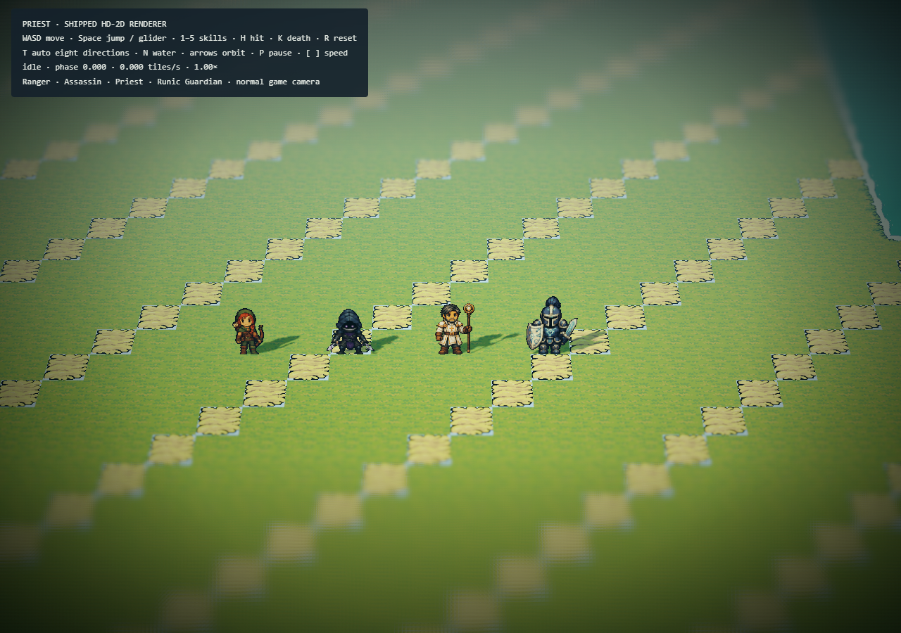

# Revue — poses entières du Prêtre LCPixel

Cette revue remplace celle de la course articulée, rejetée par l'utilisateur pour son
effet de marionnette. Les tests de longueur des os ne validaient pas le mouvement perçu.
Le squelette et les pièces peintes sont supprimés du pipeline.

La course part de six dessins complets par vue, avec deux contacts, deux passages et
deux suspensions. L'interpolation bidirectionnelle est celle du Rogue V2. Le canon,
la palette, les sorts et la mort conservent leur identité approuvée.

## Témoins examinés

Les captures utilisent Chrome, le renderer HD-2D, sa caméra normale et la vitesse de
3,65625 tuiles/s. La revue visuelle porte sur les captures successives, les clés peintes
et leurs intermédiaires. Enregistrer une vidéo ne constitue pas à lui seul un contrôle
perceptuel.

- [Course dans les huit directions](run-review.png) : transfert entre jambes, buste,
  bras mesurés, tête solidaire du corps et bâton. Les jambes ne sont plus des morceaux
  tournés séparément. Le passage opposé de face a nécessité une peinture dédiée.
- [Saut et réception](jump-review.png) : départ depuis la phase de course courante,
  montée, apex, descente et retour à la course.
- [Comparaison avec le Rogue V2](comparison.png), à taille du jeu puis agrandie.
- [Repères des clés peintes](studio-trajectories.png). Les points servent à examiner
  le recalage ; ils ne représentent pas des os ou des pieds cachés calculés.
- [Enregistrement à vitesse normale](all-directions.webm), pour rejouer les changements
  de direction dans le moteur.

`yarn priest:review` recrée les séquences complètes sous
`artifacts/priest-prototype/runtime-review/` : 12 captures de course, 10 de saut,
8 par sort et 10 de mort par direction, ainsi que dégâts, nage, planeur et groupe de quatre.
Les cinq sorts et la mort ont aussi été examinés sur des planches de captures successives.

## Contrôles

- `yarn verify` complet passé en 177,3 secondes : lint, typage, tests de tous les
  packages, migrations, catalogues/cartes/musiques, validateurs Prêtre et Assassin,
  build puis démarrage de l'artefact compilé.
- Quatre tests d'auteur : clés peintes conservées exactement, fermeture interpolée du
  cycle, deux contacts distincts, densité correcte de l'édition isolée, stabilité du
  repère de cou après réduction de palette et échelle commune des poses de sorts.
- Validateur : 18 états/huit directions, 20 raccords de boucle, extrémités des banques
  de transitions, pose de mort finale stable, sources et atlas hashés, palette et alpha.
- 48 départs de projectile : Trait radiant et Soin, huit directions et délais simulés
  de 0/100/200 ms. Le premier point affiché rejoint l'orbe à moins de 0,000001 tuile.
- Atelier : 18 clips chargés au début, milieu et terme, avec overlays, sans exception.
- Reconstruction indépendante : les 19 fichiers runtime et le rapport d'auteur sont
  identiques à l'octet près. Aucun ancien dessin de course ni texture du Rogue requis.
- Textures partagées : **159,8 Mio RGBA**, dimension maximale 4096 pixels. Aucun calcul
  de squelette, génération IA ou interpolation d'images pendant la partie.
- Charte LCPixel : 18 références verrouillées. Canon, textures du Rogue V2, Gardien
  runique et Rôdeuse inchangés.

## Limites de la validation

Le flux optique peut assouplir des contours pendant un croisement ou une occlusion,
particulièrement à fort grossissement. Il ne corrige pas une mauvaise pose source.
Les indicateurs d'images et les tests ne prouvent ni une biomécanique exacte ni une
perfection perceptuelle. La comparaison animée à taille normale reste nécessaire lors
de chaque changement de poses, de vitesse ou de caméra.
